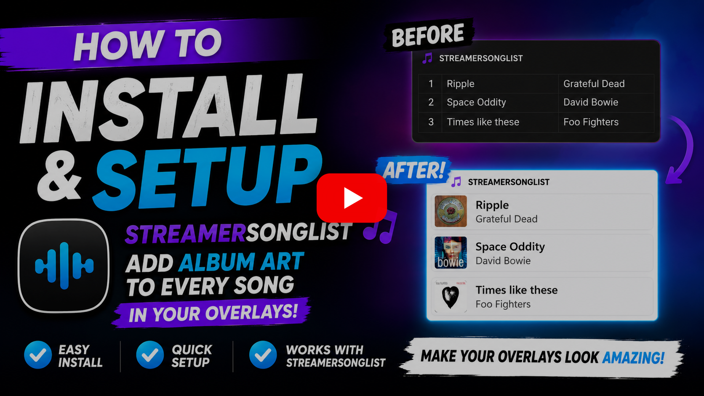
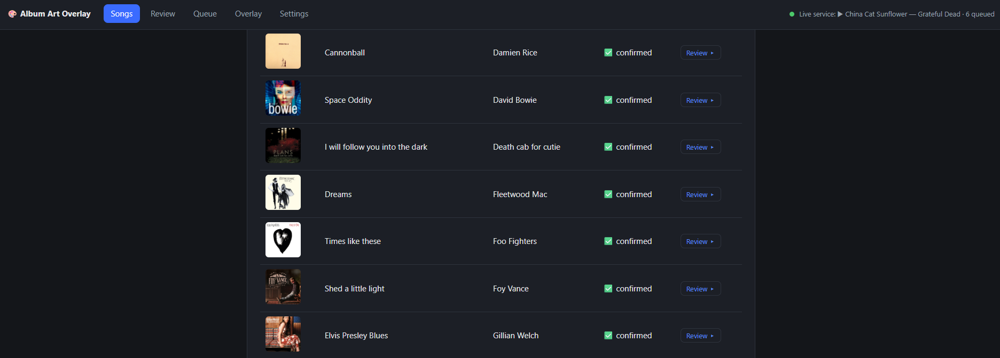
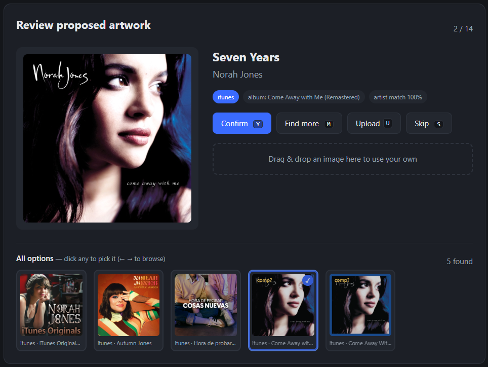
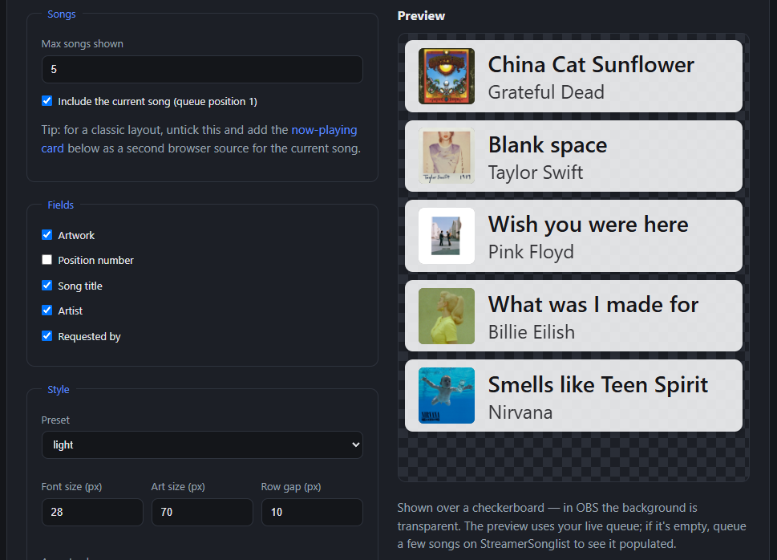

# StreamerSonglist Album Art Overlay

An OBS overlay for music streamers: album art for the current song, plus a song
queue overlay, fed live from your StreamerSonglist queue — automatically.

This tool is for music streamers who use [StreamerSonglist](https://www.streamersonglist.com).
One app — the **dashboard** — does two jobs:

- **Between streams** it pulls your songlist from StreamerSonglist, finds album
  artwork for every song, and lets you confirm, reject, or upload your own image
  for each one. The images you approve become your **artwork library**.
- **During your stream** its built-in live service polls your StreamerSonglist
  queue, takes whatever is in your now-playing slot as the current song, writes
  an artwork image file for OBS, and serves the queue and now-playing overlays. (It can also read
  a text file instead, if you drive your current song some other way.) It uses
  your approved library first; if a song isn't in the library yet, it grabs a
  best guess live and flags it so you can review it after the stream.

Artwork comes from the **iTunes Search API** first, then optionally **Last.fm**
(if you add your own key) and **MusicBrainz / Cover Art Archive**.

[](https://www.youtube.com/watch?v=1lnzu5O0h8Q)



---

## 1. What you need

- **Windows** (built and tested there; the file-saving is tuned for OBS on
  Windows). **macOS/Linux should work but are untested** — it's plain Python.
  The `.bat` launcher is Windows-only, so start it from a terminal instead:
  `python3 -m app.dashboard`. If you try it, let me know how it goes via an
  issue!
- **Python 3.10 or newer**. Get it from [python.org](https://www.python.org/downloads/).
  During install, tick **"Add Python to PATH"**.
- A **StreamerSonglist** account with some songs in your list. During a stream,
  keep the song you're playing in your SSL **now-playing** slot (or at the top of
  the queue — SSL promotes it for you). (Alternatively, point it at a text file
  your own setup writes.)
- A **StreamerSonglist API token**. StreamerSonglist's API now requires one for
  every request, so the app can't read your songlist or queue without it. It's
  free and takes a moment to create — see the next step.

## 2. Install

Download/clone this repository, open a terminal in the folder, and run:

```
pip install -r requirements.txt
```

## 3. Get your StreamerSonglist API token

StreamerSonglist's API requires a token for every request, so you need one before
the app can see your songlist.

1. Sign in at [streamersonglist.com](https://www.streamersonglist.com) and open
   your **profile**.
2. Find **API Access** and create a **user access token**.
3. Copy it — you'll paste it into the app's Settings page in the next step.

Keep it private. It's stored only in your local `config.json` (which is never
committed to git) and sent only to StreamerSonglist. Treat it like a password:
it can read *and* write every channel your account administrates, so don't paste
it into screenshots, streams, or bug reports. If it ever leaks, create a new one
from the same page.

## 4. First run — the dashboard

Double-click **`run_dashboard.bat`** (or run `python -m app.dashboard`).

- On the very first run it creates a `config.json` for you and opens the
  **Settings** page in your browser at `http://127.0.0.1:5050`.
- Fill in:
  - **Username or songlist URL** — e.g. `yourname` or
    `https://www.streamersonglist.com/t/yourname/songs`.
  - **API token** — paste the token from step 3. Then click **Test connection**:
    it should show your channel name, avatar and song count. (Once saved, the
    field shows dots instead of the token; leaving it untouched keeps the saved
    one, and there's a tickbox to remove it.)
  - **Platform** — `twitch` unless your SSL channel is on YouTube or Kick.
  - **Current song source** — leave on **StreamerSonglist queue** (recommended);
    the live service reads the top of your live queue. Only switch to **Text
    file** if another tool writes your current song to a file, and set its path
    below.
  - **Output image** — where the artwork PNG should be written (point OBS at this).
  - **Fallback image** — shown for your own originals and for songs with no art.
  - **Skip artists** — your own artist name(s), comma separated. Songs by these
    artists use the fallback image instead of searching.
  - (Optional) **iTunes country**, **Last.fm API key**, reflection/size settings.
- Click **Save settings**.

## 5. Build your artwork library

On the **Songs** page:

1. **Sync songlist** — pulls all your songs from StreamerSonglist.
2. **Bulk propose artwork** — searches iTunes for every song without art. This is
   throttled (about 3 seconds per song, to respect iTunes' rate limit), so a large
   list takes a while. You can watch the progress bar, and it's **resumable** — if
   you stop and start again it picks up where it left off.
3. Go to the **Review** page to approve artwork one song at a time:
   - **Confirm** (`Y`) — keep this image.
   - **Reject → next** (`N`) — try the next candidate (more iTunes results, then
     Last.fm, then MusicBrainz — fetched on demand).
   - **Upload** (`U`) — drag & drop or pick your own image (JPG/PNG/WebP).
   - **Skip** (`→`) — leave it for later.

The keyboard shortcuts make reviewing a long list fast.



## 6. During your stream

Keep the **dashboard** (`run_dashboard.bat`) running while you're live. It runs
a built-in live service that polls your StreamerSonglist queue every few
seconds and, whenever the now-playing song changes, writes the artwork image for
OBS. Play through your queue as usual and the artwork follows automatically —
StreamerSonglist promotes the top of your queue into the now-playing slot, and
if that slot is empty the app falls back to the top of the queue. When your
queue is empty entirely, the fallback image is shown.
The header shows a status indicator (current song and queue length) so you can
sanity-check it before going live. (With the **Text file** source the live
service reads your song file instead of the queue — everything else works the
same.)

### The queue overlay

The dashboard also serves an **up-next table** for OBS: your queue with
artwork, title, artist and requester. Open the **Overlay** page in the
dashboard to style it (presets, fields, sizes, how many songs) with a live
preview, then copy the URL into an OBS **Browser** source. The background is
transparent; style changes apply within seconds without touching OBS.



Lookup order for each song:

1. Your **confirmed** library image (also uses proposed/live images if that's all
   there is).
2. A **live search** if the song isn't in your library — the result is shown on
   stream and added to the **Review queue** in the dashboard, flagged as
   *unverified* so you can check it later.
3. The **fallback image** if nothing is found.

After a stream, open the dashboard's **Queue** page to review anything that was
grabbed live and confirm or replace it.

## 7. Your artwork library

Images live in the `library/` folder, named `Artist - Title.png`, at full
resolution. Resizing and the reflection effect happen when the image is written for
OBS, so changing the image size or reflection settings never means re-fetching.

If a proposed image is wrong, you can just **delete the file** in `library/` — the
tool notices it's gone and treats that song as needing art again.

## Files in this repo

| File | What it does |
|------|--------------|
| `run_dashboard.bat` | Start the dashboard (also run this during streams). |
| `config.example.json` | Template copied to `config.json` on first run. |
| `app/` | The application code. |
| `tools/probe_api.py` | Diagnostic: checks which StreamerSonglist API is answering and whether your token works. |

`config.json` (which holds your API token), your `library/`, and logs are **not**
committed to git — they're yours and local.

## Troubleshooting

- **`python` not found** — reinstall Python with "Add Python to PATH" ticked, or
  reopen your terminal.
- **Test connection fails** — most often a missing or mistyped **API token**
  (step 3); the app will say so if that's the cause. Otherwise check the
  username/URL — you can also paste your full songlist URL.
- **"StreamerSonglist has upgraded its API and now requires a token"** — exactly
  what it says: create a token (step 3) and paste it into Settings.
- **Which API am I talking to?** — run `python -m tools.probe_api` for a quick
  read-out of the API host, the detected version, your channel and queue. It
  never prints your token.
- **No artwork for a song** — use **Reject → next** to try other sources, or
  **Upload** your own image.
- **Last.fm is skipped** — that's expected unless you add your own free API key in
  Settings.
- **Logs** — see `artwork_fetcher.log` in the project folder.
